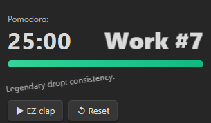
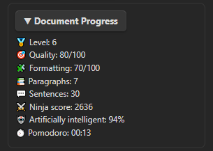
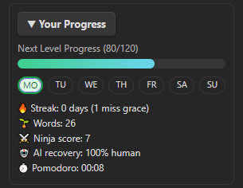
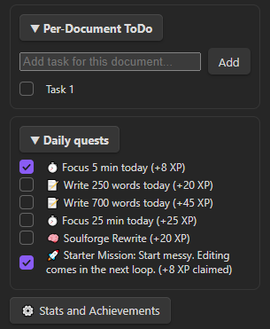

# Essay Quest for Obsidian

Gamified writing dashboard for Obsidian:

- Live document stats
- Daily progress and focus score
- Pomodoro timer (default 25/5, editable)
- Level progression with progress bar to next level
- Daily quests and achievements

## Screenshots

### Pomodoro

### Document Progress

### Daily Progress

### ToDo

## Build

1. Open terminal in this folder
2. Install deps:
   - `npm install`
3. Build:
   - `npm run build`

This generates:
- `main.js`

## Install in your vault

1. Create plugin folder in your Obsidian vault:
   - `<YourVault>\.obsidian\plugins\essay-quest\`
2. Copy these files into that folder:
   - `manifest.json`
   - `main.js`
   - `styles.css`
3. In Obsidian:
   - Settings -> Community plugins -> Turn off Safe mode (if needed)
   - Reload plugins
   - Enable `Essay Quest`

## Open dashboard

- Click sword icon on the left, or:
- Command palette: `Toggle Essay Quest Dashboard`
